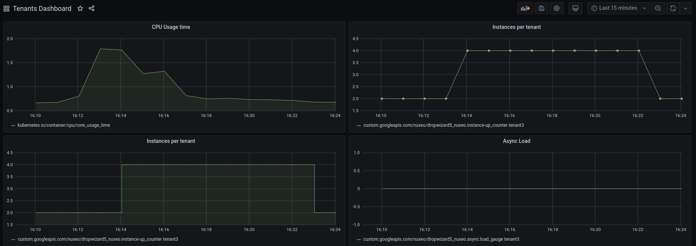
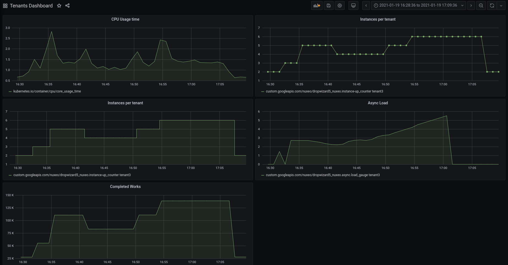

## Principles

The standard Nuxeo deployment contains 2 types of nodes:

 - API nodes: handling the synchronous workload
 - worker nodes: handling the asynchronous workload

In K8S, these 2 types of nodes are deployed via 2 dedicated deployments using the same Docker image with just a few minor configuration differences.

The goal is to scale the 2 deployments up/down depending on the load.

Typically:

 - API nodes should be scaled out when too much synchronous load is applied
    - typically, too much CPU or memory pressure
 - worker nodes should be scaled out when the lag is too big
    - size of the queues and lags of stream processors

## Metrics 

### Generic Nuxeo Metrics

Nuxeo uses Coda Hale Yammer Metrics to expose Nuxeo specific metrics.

See: https://doc.nuxeo.com/nxdoc/metrics-and-monitoring/

Nuxeo exposes a lot of metrics (JVM, Tomcat, Repository, Stream processing, Work Manager ...), and then you need to configure how to access and view the metrics:

 - JMX access
 - export to DataDog
 - export to Grafana
 - export to StackDriver
 - ...

For reference, see: 

 - [default configuration template](https://github.com/nuxeo/nuxeo/blob/master/server/nuxeo-nxr-server/src/main/resources/templates/common-base/nxserver/config/metrics-config.xml)
 - [available reporters](https://github.com/nuxeo/nuxeo/tree/master/modules/runtime/nuxeo-runtime-metrics/src/main/java/org/nuxeo/runtime/metrics/reporter)

In the context of GKE, we use the StackDriver reporter.

### StackDriver for GCP/GKE and specificities for the K8S HPA

[Horizontal Pod Autoscaler (HPA)](https://kubernetes.io/docs/tasks/run-application/horizontal-pod-autoscale/) is a standard mechanism to handle AutoScaling at the K8S level

The principle is to associate a metric and a threshold to a K8S deployment and scale out/down depending on the variation of the target metric.

For the K8S pod autoscaler to work, the metrics exposed need to be tagged with the correct resource type; otherwise, the HPA will complain that it can not read the metrics.

In GKE, we use `StackDriver` and the default resource type in opencensus is set to `k8s_container`, whereas it needs to be `k8s_pod` for the HPA to be able to read it.

In order to work around that, the deployed image include the [k8s-hpa-metrics](https://github.com/tiry/nuxeo-tenant-test-image/tree/master/plugins/k8s-hpa-metrics) addon that:

 - properly tag resources and metrics
 - exposes additional metrics dedicated to asynchronous workload

Because of the first point, the helm values files looks like this:
    ...
    metrics:
        enabled: true
        stackdriver:
            enabled: false
    ...
  
It means that we disable the default stackdriver reporter and rely on the fact the the [k8s-hpa-metrics specific reporter](https://github.com/tiry/nuxeo-tenant-test-image/blob/master/plugins/k8s-hpa-metrics/src/main/resources/OSGI-INF/metrics-config.xml) is activated.

For the second point, the addon expose an aggregated metrics called `nuxeo.async.load` that is based on:

how many asynchronous tasks are queued in `nuxeo-stream` or the WorkManager 
the lag
how fast jobs are processed
the latency 

## Deploying HPA

Use the `deploy-hpa.sh`:

 - first arg should be the target namespace
 - second arg should be the name of the company (what was used to create the deployment name)

Typically, for a tenant named `company-c` and deployed in namespace `tenant3`:

   ./deploy-hpa.sh tenant3 company-c

To verify that everything works:

    kubectl get hpa  -n tenant3 

    NAME                        REFERENCE                           TARGETS   MINPODS   MAXPODS   REPLICAS   AGE
    nuxeo-company-c-async-hpa   Deployment/nuxeo-company-c-worker   0/900m    1         5         1          7m51s
    nuxeo-company-c-cpu-hpa     Deployment/nuxeo-company-c-api      6%/80%    1         5         1          7m52s

NB: the name of the metric used in the HPA depends on the underlying monitoring system: typically since here we go through StackDriver the Nuxeo metrics name is changed.
For example:

name at the nuxeo level

    nuxeo.async.load

name in stack  driver

    custom.googleapis.com|nuxeo|dropwizard5_nuxeo.async.load_gauge

## Testing Autoscaling

### Simple load testing

The [k8s-hpa-metrics](https://github.com/tiry/nuxeo-tenant-test-image/blob/master/plugins/k8s-hpa-metrics/src/main/resources/OSGI-INF/operation-contrib.xml) provides 2 Automation Operation that allow simulating load on the Nuxeo side.

This is very basic and not as meaningful as the [default Gatling tests that are part of the Nuxeo Server distribution](https://github.com/nuxeo/nuxeo/tree/master/ftests/nuxeo-server-gatling-tests/src/test/scala/org/nuxeo/cap/bench): but it allows to conduct a simple test to check that autoscaling works.

### API Nodes

#### Generating load to validate Scale-out

In this example, we will generate load on `company-c` that is hosted in `tenant3`

    ./inject_cpu_load.sh company-c

#### Checking deployment autoscaling

You can check the Events in the corresponding deployment.

    kubectl describe deployment nuxeo-company-c-api -n tenant3

    Name:                   nuxeo-company-c-api
    Namespace:              tenant3
    ...
    Events:
        Type    Reason             Age   From                   Message
        ----    ------             ----  ----                   -------
        Normal  ScalingReplicaSet  60m   deployment-controller  Scaled up replica set nuxeo-company-c-api-69978c67f8 to 1
        Normal  ScalingReplicaSet  7m4s  deployment-controller  Scaled up replica set nuxeo-company-c-api-69978c67f8 to 3
        Normal  ScalingReplicaSet  4s    deployment-controller  Scaled down replica set nuxeo-company-c-api-69978c67f8 to 1

You can also check the HPA

    kubectl describe  hpa nuxeo-company-c-api   -n tenant3

    Name:                                                  nuxeo-company-c-api
    Namespace:                                             tenant3
    ...
    Min replicas:                                          1
    Max replicas:                                          5
    Deployment pods:                                       1 current / 1 desired
    Conditions:
    Type            Status  Reason              Message
    ----            ------  ------              -------
    AbleToScale     True    ReadyForNewScale    recommended size matches current size
    ScalingActive   True    ValidMetricFound    the HPA was able to successfully calculate a replica count from cpu resource utilization (percentage of request)
    ScalingLimited  False   DesiredWithinRange  the desired count is within the acceptable range
    Events:
    Type    Reason             Age    From                       Message
    ----    ------             ----   ----                       -------
    Normal  SuccessfulRescale  7m37s  horizontal-pod-autoscaler  New size: 3; reason: cpu resource utilization (percentage of request) above target
    Normal  SuccessfulRescale  37s    horizontal-pod-autoscaler  New size: 1; reason: All metrics below target

#### Monitoring

The screenshot below shows how API nodes auto-scale when CPU load is applied.

The current dashboard show only one tenant deployed with initially 1 API node and 1 worker node.

### Worker nodes

#### Generating load to validate Scale-out

In this example, we will generate async workload on `company-c` that is hosted in `tenant3`

    ./inject_worker_load.sh company-c

#### Checking deployment autoscaling

You can check the Events in the corresponding hpa

    kubectl describe hpa nuxeo-company-c-worker -n tenant3
    
    Name:                                                          nuxeo-company-c-worker
    Namespace:                                                                   tenant3
    ...
    Events:
    Type    Reason             Age   From                       Message
    ----    ------             ----  ----                       -------
    Normal  SuccessfulRescale  27m   horizontal-pod-autoscaler  New size: 2; reason: pods metric custom.googleapis.com|nuxeo|dropwizard5_nuxeo.async.load_gauge above target
    Normal  SuccessfulRescale  18m   horizontal-pod-autoscaler  New size: 3; reason: pods metric custom.googleapis.com|nuxeo|dropwizard5_nuxeo.async.load_gauge above target
    Normal  SuccessfulRescale  8m7s  horizontal-pod-autoscaler  New size: 1; reason: All metrics below target

#### Monitoring

The screenshot below shows how Worker nodes auto-scale when ASync workload is applied.

The current dashboard show only one tenant deployed with initially 1 API node and 1 worker node.

